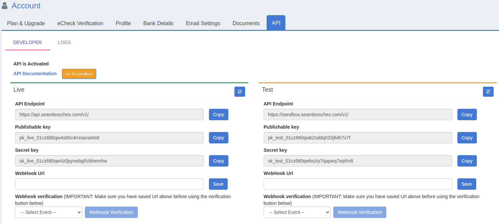

# Node.js library for the SeamlessChex REST API

This library provides convenient access to the [SeamlessChex REST API](https://developers.seamlesschex.com/seamlesschex/docs/) from applications written in Node.js.
   
## Configuration

The package needs to be configured with your account's API Key and API Secret.

:key: The API credentials below are from the ```demo``` environment and you can use them to try the API.

``` js
var SeamlesschexAPI = require('seamlesschex');
var Seamlesschex = new SeamlesschexAPI('sk_test_01en8e264mt148md2f8xkx6afs');
```    
  
You can get the API Key and API Secret values from the [Settings](https://portal.seamlesschex.com/#/merchant-api) page.


   
## Usage

You can use the following code snippet to send a digital check:

``` js
const objCreatedCheck = await Seamlesschex.checks.create({
    "number": Number(String(Date.now()).substr(-10)), // unique check number
    "amount": 100 ,
    "memo": "Law Office Robert Aaron, FL" ,
    "name": "Robert Aaron" ,
    "email": "robertaaron@example.com" ,
    "authorization_date": "2020-07-22" ,
    "label": "Label" ,
    "phone": "1728514288" ,
    "address": "3881 Coquina Ave" , 
    "city": "North Port" ,
    "state": "FL" ,
    "zip": "34286" ,
    "bank_routing": "021000021" ,
    "verify_before_save": true ,
    "fund_confirmation": false,
    ...checkSecurityData
}
    .catch(errorHandler);
        console.log('objCreatedCheck: ', objCreatedCheck);
```

You can use the following code snippet to query the list of checks:

``` js
const listChecks = await Seamlesschex.checks.list({ limit: 15, page: 1, sort: 'date', direction: 'DESC'  })
    .catch(errorHandler);
  console.log('listChecks: ', listChecks);
```

:star: You can find more [code samples here](samples).  

## Methods reference

The ```Seamlesschex``` class has several endpoints and you can find below the methods each one provides.  

You can click on the :link: icon to access the detailed API reference for each method. 

 * __Seamlesschex.checks__
    * ```create(params)``` [:link:](https://developers.seamlesschex.com/seamlesschex/docs/#create-a-check)
 	* ```list(query)``` [:link:](https://developers.seamlesschex.com/seamlesschex/docs/#list-all-checks)
 	* ```get(check_id)``` [:link:](https://developers.seamlesschex.com/seamlesschex/docs/#retrieve-a-check)
    * ```getBankInfo(bank_routing)``` [:link:](https://developers.seamlesschex.com/seamlesschex/docs/#retrieve-bank-information)
    * ```update(bank_routing)``` [:link:](https://developers.seamlesschex.com/seamlesschex/docs/#update-a-check)
    * ```void(check_id)``` [:link:](https://developers.seamlesschex.com/seamlesschex/docs/#void-a-check)
 	
 * __Seamlesschex.tokens__
 	* ```create(params)``` [:link:](https://developers.seamlesschex.com/seamlesschex/docs/#tokenization)
 
---

:bulb: The ```query``` object used for the ```list(query)``` methods can have the following attributes:  
  * ```from_date : 'YYYY-MM-DD'```  
  * ```to_date   : 'yyyy-mm-dd'```  
  * ```direction : 'DESC'|'ASC'```  
  * ```sort: ' 'date'|'number'|'name''```  
  * ```limit : 10|25|50```    
  * ```page : [1..N]```
 
## Getting help

If you need help installing or using the library, please contact seamlesschex.com Support at support@seamlesschex.com.  

If you've instead found a bug in the library or would like new features added, please open issues or pull requests against this repo.

## More Information

 * [API Endpoints](https://developers.seamlesschex.com/seamlesschex/docs/#api-endpoints)
 * [Error Codes](https://developers.seamlesschex.com/seamlesschex/docs/#errors)